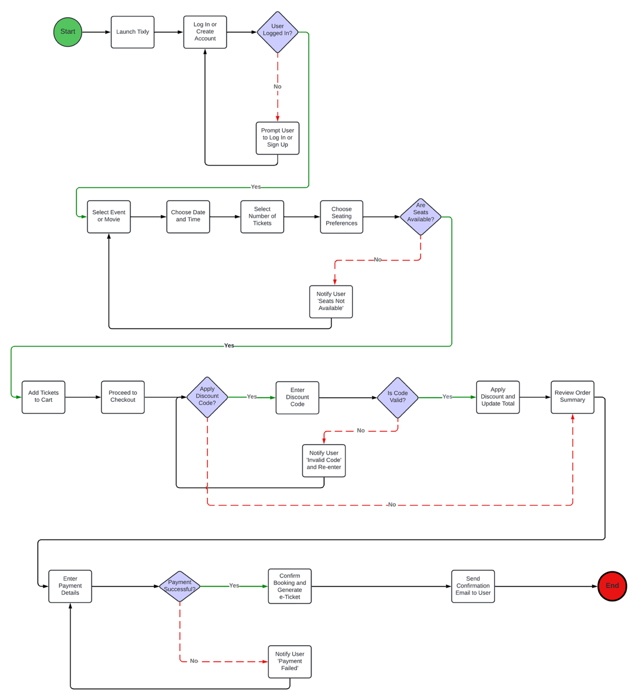
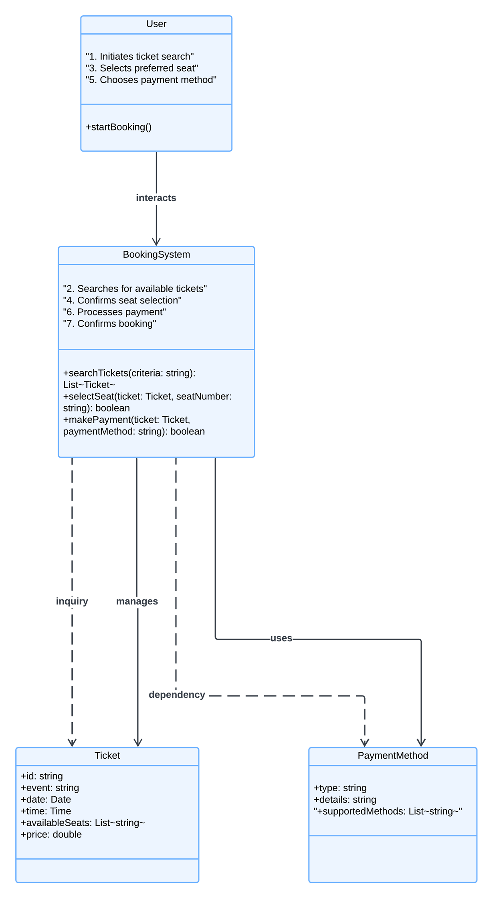
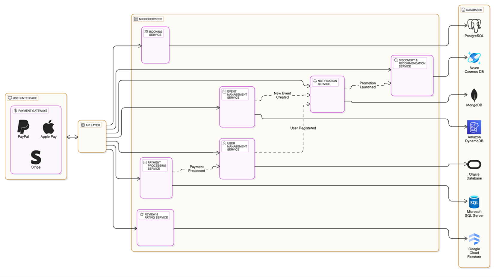
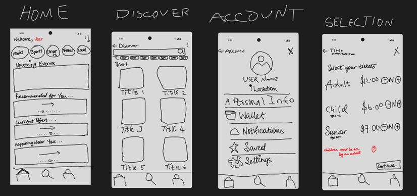
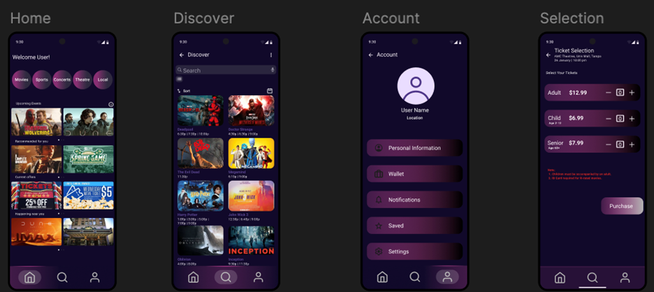

# Mobile Ticketing App Design

A project showcasing the design and architecture of a mobile ticketing application.

## Summary
This app is designed to provide users with a simple, reliable way to purchase, store, and validate tickets on mobile devices.  
The goals include a clear architecture, smooth user experience, and scalable microservices design.

## Deliverables
- Final report (PDF)
- Process flow chart
- UML class diagram
- Microservices architecture diagram
- Low-fidelity design
- High-fidelity design

## Tools and Methods
- UML modeling
- Microservices architecture design
- Design prototyping (low- and high-fidelity)

## Diagrams and Designs
Process Flow Chart:
- 

UML Class Diagram:
- 

Microservices Architecture:
- 

Low-Fidelity Design:
- 

High-Fidelity Design:
- 


## Folder Structure
```
.
├── report/
│   └── mobile_ticketing_report.pdf
├── images/
│   ├── process_flow.png
│   ├── uml_class.png
│   ├── microservices.png
│   ├── low_fidelity.png
│   └── high_fidelity.png
└── README.md
```
